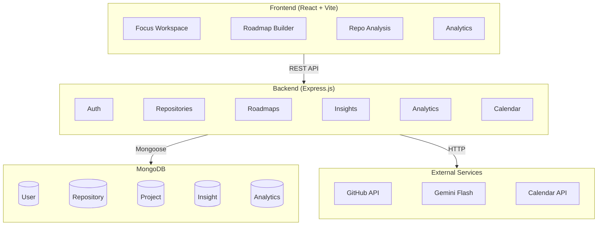

<p align="center">
  
  
  
</p>

<h1 align="center">GitMentor</h1>

<p align="center">
  <strong>AI-Powered Developer Growth & Portfolio Mentorship Platform</strong>
</p>

<p align="center">
  Build authentic GitHub portfolios with AI-guided mentorship, personalized roadmaps, and gamified progress tracking.
</p>

<p align="center">
  <a href="#features">Features</a> &bull;
  <a href="#feature-status-tracker">Status Tracker</a> &bull;
  <a href="#tech-stack">Tech Stack</a> &bull;
  <a href="#architecture">Architecture</a> &bull;
  <a href="#getting-started">Getting Started</a> &bull;
  <a href="#api-reference">API Reference</a> &bull;
  <a href="#contributing">Contributing</a>
</p>

---

## About

GitMentor is a full-stack web application that helps developers, especially those starting out, build strong GitHub portfolios through real mentorship instead of fake activity generation.

It connects to your GitHub account, analyzes what you've built so far, figures out where the gaps are, and then generates personalized project roadmaps using Google Gemini. You can sync those roadmaps to Google Calendar, get AI-powered code reviews on your repos, and track your progress through a gamification system with 12 achievement badges.

The whole idea is simple: stop watching tutorials and start shipping real projects, with an AI mentor guiding you through the process.

**Author:** [Humais Ali](https://github.com/humaisali)

---

## Features

### 1. GitHub Profile Analysis
The system connects to your GitHub account and scans your repositories, contribution history, languages used, stars, forks, and overall activity patterns. It gives you a clear picture of where you stand as a developer based on real data.

### 2. AI Skill Assessment
Using the data pulled from GitHub, the AI engine estimates your skill level (Beginner, Intermediate, or Advanced), identifies gaps in areas like frontend, backend, deployment, testing, and architecture, and generates a technical profile of your strengths and weaknesses.

> **Status:** In Progress. The AI receives your repo stats and uses them for roadmap tailoring, but the dedicated Skill Profile page with visual gap analysis is still being built.

### 3. Personalized Project Roadmap Generation
Describe what you want to learn or build, and the AI generates a structured, multi-phase project curriculum tailored to your skill level, preferred technologies, and career goals. Projects are arranged progressively so you're always building on what you've already learned.

### 4. Build Day Scheduling
Schedule dedicated coding sessions (called Build Days) and sync them directly to your Google Calendar. Each session is tied to your roadmap milestones, so you always know what to work on and when.

### 5. AI Mentor Assistance
While you're working through a project, the AI acts as your mentor. It provides architecture suggestions, helps break tasks into manageable steps, offers debugging guidance, and gives you actionable development support. Think of it as having a senior developer available whenever you need direction.

### 6. Repository Code Review
Submit any of your repositories for an AI-powered review. The system evaluates code quality, security vulnerabilities, scalability, readability, documentation, and maintainability, then gives you specific feedback on what to improve.

### 7. Progress Dashboard & Analytics
The Focus Workspace dashboard gives you a real-time view of your journey: AI-generated actionable insights, a repository overview, key developer metrics, a live GitHub activity feed, and a contribution calendar heatmap. Everything in one place.

### 8. Gamification & Consistency Tracking
The system monitors your contribution consistency and rewards progress with 12 achievement badges that are automatically evaluated against your live GitHub stats. From maintaining streaks to earning stars, every milestone is tracked.

| Badge | What You Need |
|:------|:------------|
| Early Adopter | Sync your GitHub account with GitMentor |
| Streak Master | 10-day contribution streak |
| Iron Coder | 30-day contribution streak |
| Centurion | 100 total contributions this year |
| Polyglot | 5+ languages across your repos |
| Star Gazer | 50+ total stars |
| Trend Setter | A single repo with 50+ stars |
| Community Builder | 20+ followers |
| Social Butterfly | Following 20+ developers |
| Open Source Contributor | 10+ Pull Requests |
| Issue Hunter | 10+ Issues |
| Fork Magnet | 20+ forks across repos |

### 9. Customizable Project Goals
You're in control of the pace. When working through a roadmap, you can choose between Aggressive, Moderate, or Relaxed timelines. The system adapts the project schedule and milestones based on your preference.

### 10. AI Task Breakdown Generation
For each project phase in your roadmap, the AI generates detailed, dynamic checklists with specific tasks. No more staring at a blank screen wondering what to build next; the work is already broken down for you.

---

## Feature Status Tracker

### System Features (from SRS)

| # | Feature | Status |
|:-:|:--------|:------:|
| 1 | GitHub Profile & Repository Analysis | Completed |
| 2 | AI Skill Assessment Engine | In Progress |
| 3 | Personalized Project Roadmap Generation | Completed |
| 4 | Build Day Scheduling with Google Calendar Sync | Completed |
| 5 | AI Mentor Assistance | Completed |
| 6 | AI-Powered Repository Code Review | Completed |
| 7 | Progress Dashboard & Analytics | Completed |
| 8 | Gamification & Contribution Consistency Tracking | Completed |
| 9 | Customizable Project Goals & Pacing | Completed |
| 10 | AI Task Breakdown Generation | Completed |

### Functional Requirements (from SRS)

| ID | Requirement | Status |
|:---|:-----------|:------:|
| FR-1 | User can authenticate using GitHub | Completed |
| FR-2 | User can connect Google Calendar | Completed |
| FR-3 | System can fetch repositories | Completed |
| FR-4 | System can analyze developer skills | In Progress |
| FR-5 | AI can recommend projects | Completed |
| FR-6 | User can schedule Build Days | Completed |
| FR-7 | AI can provide development guidance | Completed |
| FR-8 | System can review repositories | Completed |
| FR-9 | Dashboard can track progress | Completed |
| FR-10 | AI can generate task breakdowns | Completed |
| FR-11 | System can monitor contribution consistency | Completed |
| FR-12 | User can customize project goals | Completed |

### SRS Module Compliance

| Module | Status |
|:-------|:------:|
| Authentication Module | Completed |
| GitHub Analysis Module | Completed |
| AI Skill Engine | In Progress |
| Recommendation Module | Completed |
| Build Day Scheduler | Completed |
| AI Mentor Module | Completed |
| Repository Review Module | Completed |
| Dashboard Module | Completed |

### Upcoming Work

| Feature | Description | Status |
|:--------|:-----------|:------:|
| AI Skill Profile Page | Visual skill-level dashboard with gap analysis UI | In Progress |
| Continuous Learning Loop | Feed recent commits back to the AI for adaptive mid-project guidance | Planned |
| Zero-Data Onboarding | Guided onboarding flow for new GitHub accounts with no repos | Planned |
| Production Deployment | Unified build configuration for Vercel/Render | Planned |

### Future Enhancements (from SRS)

| Feature | Status |
|:--------|:------:|
| Browser-based coding playground | Planned |
| AI interview preparation | Planned |
| Mobile application | Planned |
| Team collaboration features | Planned |
| Open-source contribution assistant | Planned |
| Advanced learning analytics | Planned |

---

## Tech Stack

### Frontend
| Technology | Version | Purpose |
|:-----------|:--------|:--------|
| React | 19.2 | UI with functional components and hooks |
| Vite | 8.0 | Build tool and dev server |
| Tailwind CSS | 4.3 | Utility-first styling with custom design tokens |
| React Router | 7.15 | Client-side routing |
| Lucide React | 1.16 | Icon library |
| Geist Sans | - | Primary font |
| JetBrains Mono | - | Monospace font for code and data |

### Backend
| Technology | Version | Purpose |
|:-----------|:--------|:--------|
| Node.js | - | Server runtime |
| Express.js | 5.2 | REST API framework |
| MongoDB | - | Document database |
| Mongoose | 9.6 | MongoDB ODM |
| Passport.js | 0.7 | OAuth strategies |
| JWT | 9.0 | Token-based auth |
| Google GenAI SDK | 2.10 | Gemini Flash integration |
| Google APIs | 173.0 | Calendar API |

---

## Architecture

### System Overview



### Layer Breakdown

| Layer | Technology | Responsibilities |
|:------|:-----------|:-----------------|
| Frontend | React 19, Vite 8, Tailwind CSS 4 | Dashboard rendering, roadmap visualization, user interaction, analytics display |
| Backend | Node.js, Express.js 5 | API handling, authentication, repository processing, AI request management |
| Database | MongoDB, Mongoose 9 | Stores users, projects, progress data, AI feedback, and roadmap information |
| AI | Google Gemini Flash SDK | Skill assessment, roadmap generation, mentorship, code reviews |
| External | GitHub API, Google Calendar API | Repository data, contribution tracking, Build Day scheduling |

### Project Structure

```
GitMentor/
│
├── frontend/                    # React + Vite + Tailwind CSS v4
│   └── src/
│       ├── components/
│       │   ├── ui/              # Reusable UI primitives (Card, Button, Input, Badge, Skeleton)
│       │   └── widgets/         # Dashboard widgets (AI Insights, Repo Overview, Metrics, Activity Feed, Calendar)
│       ├── context/             # AuthContext for global auth state
│       ├── layouts/             # DashboardLayout (sidebar + content area)
│       └── pages/               # Route-level pages
│           ├── FocusWorkspace   # Main dashboard with widget grid
│           ├── Analytics        # Gamification, badges, GitHub stats
│           ├── Roadmap          # AI roadmap generation and listing
│           ├── ProjectDetails   # Phase execution and tracking
│           ├── Repositories     # Repo list with AI analysis
│           └── Settings         # Account configuration
│
├── backend/                     # Node.js + Express.js + Mongoose
│   ├── server.js                # Entry point and middleware setup
│   └── src/
│       ├── config/              # Passport OAuth strategies (GitHub, Google)
│       ├── controllers/         # Business logic (auth, repos, roadmaps, insights, calendar, analytics)
│       ├── middlewares/         # JWT verification
│       ├── models/              # Mongoose schemas (User, Repository, Project, Insight, Analytics, BuildSession)
│       ├── routes/              # Express route definitions for each API domain
│       └── utils/               # GitHub API client, Gemini AI client, badge evaluation rules
│
└── Documentation/               # SRS document and progress tracker
```

---

## Getting Started

### Prerequisites

- **Node.js** v18 or higher
- **MongoDB** (local or [MongoDB Atlas](https://www.mongodb.com/atlas))
- A **GitHub OAuth App** ([create one here](https://github.com/settings/developers))
- A **Google Cloud Project** with Calendar API and OAuth 2.0 credentials
- A **Gemini API Key** ([get one here](https://aistudio.google.com/apikey))

### 1. Clone the repo

```bash
git clone https://github.com/humaisali/GitMentor.git
cd GitMentor
```

### 2. Set up the backend

```bash
cd backend
npm install
```

Create a `.env` file in `backend/`:

```env
PORT=5000
NODE_ENV=development

MONGO_URI=mongodb://localhost:27017/gitmentor

JWT_SECRET=your_jwt_secret_key

GITHUB_CLIENT_ID=your_github_client_id
GITHUB_CLIENT_SECRET=your_github_client_secret
GITHUB_CALLBACK_URL=http://localhost:5000/api/auth/github/callback

GOOGLE_CLIENT_ID=your_google_client_id
GOOGLE_CLIENT_SECRET=your_google_client_secret
GOOGLE_CALLBACK_URL=http://localhost:5000/api/auth/google/callback

GEMINI_API_KEY=your_gemini_api_key

CLIENT_URL=http://localhost:5173
```

Start the server:

```bash
npm run dev
```

### 3. Set up the frontend

```bash
cd ../frontend
npm install
npm run dev
```

### 4. Open it up

Go to **http://localhost:5173** and sign in with GitHub.

---

## API Reference

All endpoints are under `/api`. Routes marked with Auth require a valid JWT token.

| Method | Endpoint | Description | Auth |
|:-------|:---------|:------------|:----:|
| GET | `/api/health` | Health check | No |
| GET | `/api/auth/github` | Start GitHub OAuth | No |
| GET | `/api/auth/github/callback` | GitHub OAuth callback | No |
| GET | `/api/auth/google` | Start Google OAuth | No |
| GET | `/api/auth/google/callback` | Google OAuth callback | No |
| GET | `/api/auth/me` | Current user profile | Yes |
| GET | `/api/repositories` | List user repositories | Yes |
| GET | `/api/repositories/:id` | Repository details | Yes |
| POST | `/api/repositories/:id/analyze` | Run AI analysis on a repo | Yes |
| POST | `/api/insights/generate` | Generate AI insights | Yes |
| GET | `/api/insights` | Get saved insights | Yes |
| POST | `/api/roadmaps/generate` | Generate an AI roadmap | Yes |
| GET | `/api/roadmaps` | List user roadmaps | Yes |
| GET | `/api/roadmaps/:id` | Roadmap details | Yes |
| POST | `/api/calendar/sync` | Sync roadmap to Google Calendar | Yes |
| GET | `/api/analytics` | Get gamification stats | Yes |
| POST | `/api/analytics/evaluate` | Evaluate badge eligibility | Yes |

---

## Database Schema

| Model | Key Fields | Purpose |
|:------|:-----------|:--------|
| User | `githubId`, `googleId`, `username`, `avatarUrl`, `accessToken`, `googleRefreshToken` | User profile and OAuth credentials |
| Repository | `userId`, `githubRepoId`, `name`, `language`, `stars`, `forks` | Cached GitHub repo data |
| Project | `userId`, `title`, `description`, `phases[]`, `pacing`, `status` | AI-generated project plans and execution state |
| Insight | `userId`, `repositoryId`, `type`, `feedback`, `score` | AI code review and analysis records |
| Analytics | `userId`, `unlockedBadges[]`, `stats`, `lastEvaluated` | Gamification state and badge tracking |
| BuildSession | `userId`, `projectId`, `scheduledDate`, `status` | Scheduled coding sessions |

---

## Contributing

Contributions are welcome. Here's the workflow:

1. Fork the repo
2. Create a feature branch (`git checkout -b feature/your-feature`)
3. Commit your changes (`git commit -m 'Add your feature'`)
4. Push to your branch (`git push origin feature/your-feature`)
5. Open a Pull Request

Please follow the existing MVC structure, use the established Tailwind design tokens, and keep AI prompts JSON-schema enforced.

---

## License

MIT License. See [LICENSE](LICENSE) for details.

---

## Acknowledgments

- [Google Gemini](https://ai.google.dev/) for AI mentorship and roadmap generation
- [GitHub API](https://docs.github.com/en/rest) for repository and contribution data
- [Google Calendar API](https://developers.google.com/calendar) for Build Day scheduling
- [Passport.js](http://www.passportjs.org/) for OAuth strategies
- [MongoDB](https://www.mongodb.com/) for flexible document storage
- [Vite](https://vitejs.dev/) for the frontend build tooling
- [Tailwind CSS](https://tailwindcss.com/) for the styling system
- [Lucide](https://lucide.dev/) for the icon library

---

<p align="center">
  <strong>Built by <a href="https://github.com/humaisali">Humais Ali</a></strong>
</p>

<p align="center">
  Real skills. Real projects. Real growth.
</p>
